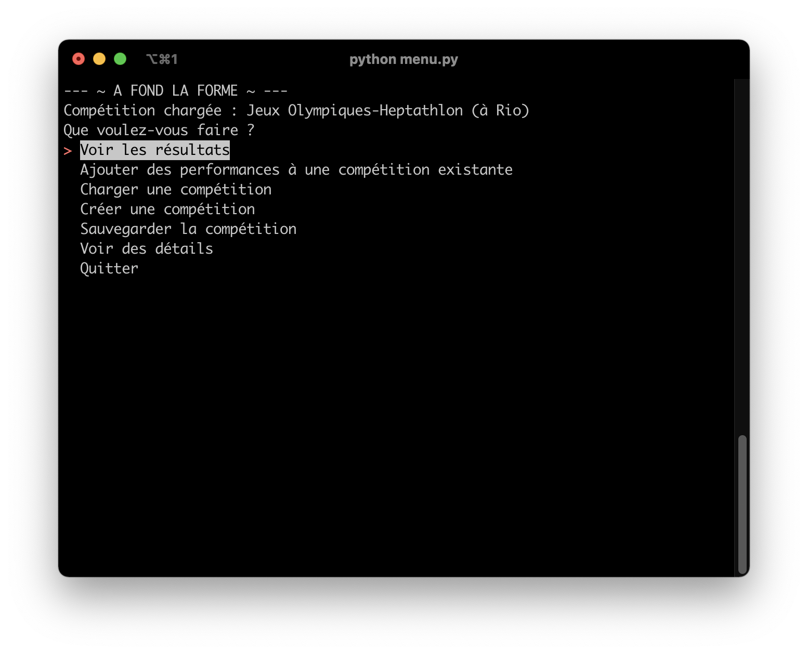

# A fond la forme



Ce projet est réalisé dans le cadre d'un cours dispensé en semestre 9 à l'[Ecole Nationale d'Ingénieurs de Tarbes](https://www.enit.fr/)
Projet permettant de gérer une compétition d'épreuves combinées outdoor. Les épreuves implémentées sont :
- Décathlon (10 épreuves)
- Heptathlon (7 épreuves)

Les performances de chaque épreuve sont converties en points avec un barème établi par World Athletics ([Tables de Cotation de l’IAAF pour les Epreuves Combinées](https://www.worldathletics.org/about-iaaf/documents/technical-information)). Le participant qui a le total le plus élevé remporte la compétition. 

## Décathlon
Le décathlon est une épreuve combinée d'athlétisme se disputant à l'extérieur et réalisée par les hommes (en compétition officielle). Les 10 épreuves doivent se dérouler selon le schéma suivant :

|Premier jour|Deuxième jour|
| :---: | :---: |
|100m|110m Haies|
|Saut en longueur|Lancer du disque|
|Lancer du poids|Saut à la perche|
|Saut en hauteur|Lancer du javelot|
|400m|1500m|

Le record du monde actuel est détenu par le français [Kévin Mayer](https://fr.wikipedia.org/wiki/Kevin_Mayer) avec 9125 points, effectué au Décastart à Talence(France) en 2018.

## Heptathlon
L'heptathlon est une épreuve combinée d'athlétisme se disputant à l'extérieur et réalisée par les femmes (en compétition officielle). A noter que l'heptathlon est disputé par les hommes mais en salle. Les 8 épreuves doivent se dérouler selon le schéma suivant :

|Premier jour|Deuxième jour|
| :---: | :---: |
|100m Haies|Saut en longueur|
|Saut en hauteur|Lancer du javelot|
|Lancer du poids|800m|
|200m||

Le record du monde actuel est détenu par l'américaine [Jackie Joyner-Kersee](hhttps://fr.wikipedia.org/wiki/Jackie_Joyner-Kersee) avec 7 291 points, lors des Jeux Olympiques de Séoul en 1988 (ndlr : des soupçons de dopage sont liés à ce record).

## Configuration requise
- Sytème de la famille UNIX (Windows non supporté)
- [Python 3.9](https://www.python.org/downloads/) minimun

## Installation
Pour installer le logiciel, il faut d'abord installer les modules *pip*. Il est recommandé d'utiliser un environnement virtuel type *virtualenv*.
```
pip install -r requirements.txt
```

Pour installer les compétitions pré-installées, il faut créer un dossier *storage* et excécuter le script *data.py*
```
mkdir storage
python data.py
```

## Fichiers de lancement
Pour lancer le menu interactif, il faut lancer le script *menu.py*.

Deux autres fichiers de lancement, *main.py* et *main2.py*, sont présents également. Il s'agit de 2 scripts utilisant le système de classe.

## Formatage
Formatage des fichiers avec *[Black](https://pypi.org/project/black/)*
```
black {fichier.py}
```

## Modules utilisés
- [prettytable](https://pypi.org/project/prettytable/) par Luke Maurits
- [simple-term-menu](https://pypi.org/project/simple-term-menu/) par Ingo Meyer
- [Black](https://pypi.org/project/black/) par Łukasz Langa
